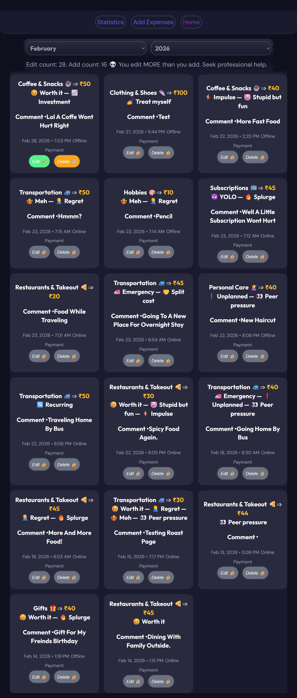
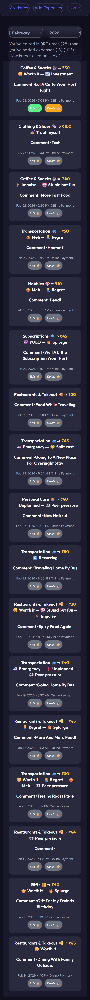
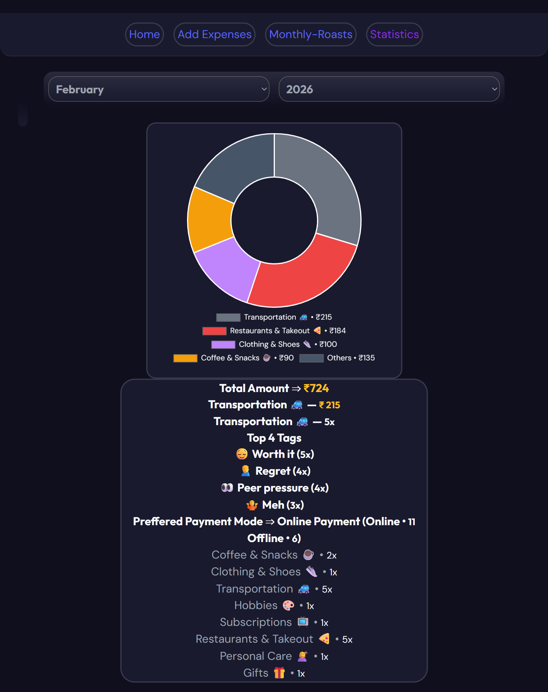
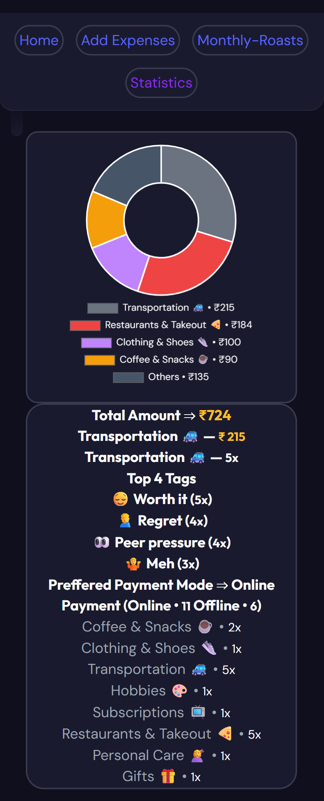
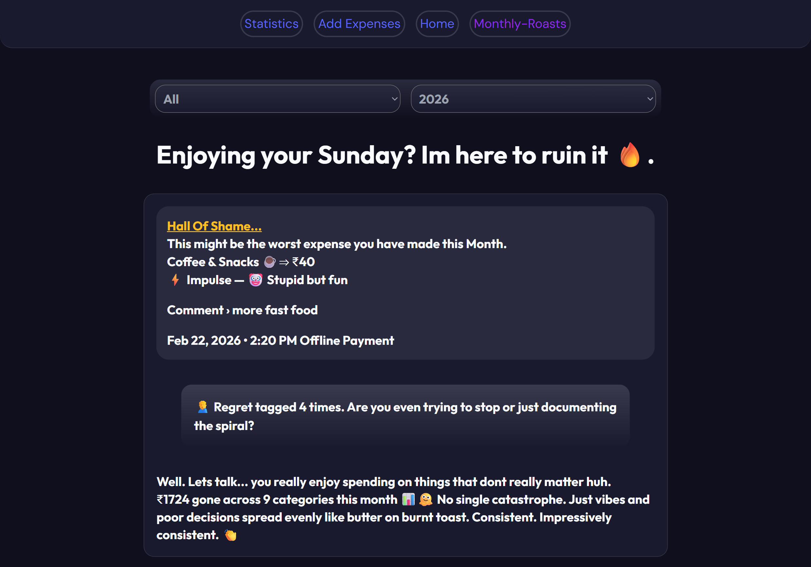
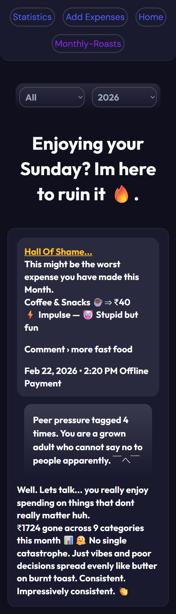

# Expenses Tracker — The Diary That Judges You

> Most expense trackers politely log your transactions and shut up.  
> This one doesn't.

It does all the boring stuff a regular expense tracker does — logs transactions, categories, payment modes. But unlike every other tracker, it watches *you* too. How many times you add, edit, delete. And after 24 hours? You can't touch that expense. History is history. Like your browser history, except this one doesn't have an incognito mode.

---

## What Makes It Different

The app has a built-in **Roast Engine** that analyzes *how* you interact with your expenses — not just what you spend.

- Editing your history much? You get punished.
- Deleting more expenses than you're adding... how is that even possible?
- All of the above is also an option for you, we call it the Chaotic tier.

There are 3 tiers of roasts awaiting you — scaling from a nudge to a full intervention.

---

## Features

**The Basics**
- Log expenses with category? Yep, plenty available. Tags? Sure, fit your style. Comments? Well, why not.
- See your deepest transactions with a month/year filter.
- Persistent storage via `localStorage` — your data stays with me and I read it every night.

**The Roast System**
- Tier-based roast system built just for you — driven by the ratio of your edit, add and delete counts.
- Each ratio has its own 3 tiers of roasts, and they're all looking for their next victim.
- Tag-based roasts that call out your worst spending patterns — because `Impulse` and `Regret` don't lie.
- A dynamic Hall of Shame on the monthly roast page that somehow always finds your worst transaction. Don't ask how. It just knows.

**Guardrails (For Your Own Good)**
- Edit and Delete buttons lock after 24 hours. I gave you enough time to change your mind — you didn't, that's on you.
- Can't let you delete everything, that's literally the data I use to roast you. Nice try though.
- Tags are capped at 4 — because I know some of you would tag every single one otherwise.

**Stats Page**
- Doughnut chart showing spending by category
- Most-used category, preferred payment mode, top 4 tags
- Works per-month or across the full year

**UI**
- Responsive — works on desktop and mobile
- 22 preset categories, each with their own emoji because why not
- Custom datetime because the default browser input sucks — or just take the pain and log future and past expenses manually

---

## Tech Stack

- **Vanilla JavaScript** (ES Modules)
- **HTML / CSS** — no frameworks
- **Chart.js** — for the stats doughnut chart
- **Day.js** — date formatting and filtering
- **localStorage** — persistent data storage

---

## Project Structure

```
Expenses-Tracker/
├── index.html              # Add expense page
├── Home.html               # View all expenses
├── Statistics.html         # Stats & charts
├── MonthlyRoasts.html      # Monthly roast page
├── CSS/                    # Per-page stylesheets + utility
└── Javascript/
    ├── AddExpenses.js
    ├── Home.js
    ├── Statistics.js
    ├── RoastPage.js
    ├── utility.js          # Shared helpers (filtering, rendering, storage)
    └── Data/
        ├── expenses.js     # localStorage expense data
        ├── RoastData.js    # Roast engine + analytics
        ├── Roastbase.js    # Roast content, tiers & parameters
        ├── category.js     # Category list
        └── tags.js         # Tag list
```

---

## Getting Started

No build step. No npm install. Just open it.

1. Clone the repo:
   ```bash
   git clone https://github.com/Bijay-Codes/Expenses-Tracker.git
   ```
2. Open `index.html` in your browser
3. Start logging. Prepare to be judged.

> ⚠️ Uses ES Modules — open via a local server (e.g. VS Code Live Server) rather than directly from the file system to avoid CORS issues.

---

## How The Roast Engine Works

The engine tracks three behavioral ratios:

| Ratio | What It Detects |
|---|---|
| `editCount / addCount` | Indecisive behavior — you keep changing your story to fit in. |
| `deleteCount / addCount` | Denial — you're erasing evidence and my data for roasts. |
| `(edit + delete) / add` | Full chaos — no comment needed |

Each ratio maps to a tier (1–3), and each tier has its own set of roasts that get progressively more brutal. On top of that, tagged expenses are scanned for red-flag keywords and roasted separately on the Monthly page.

---

## Screenshots

| Desktop | Mobile |
|---------|--------|
|  |  |
|  |  |
|  |  |

---

